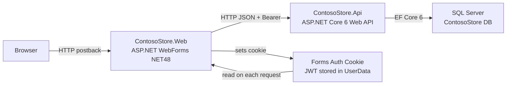
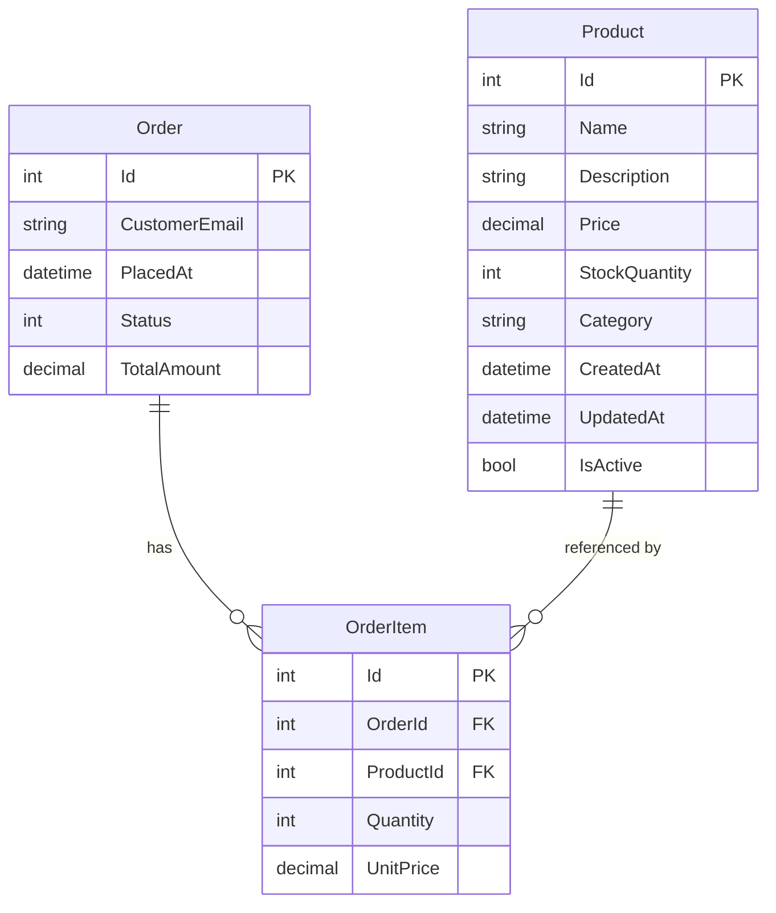
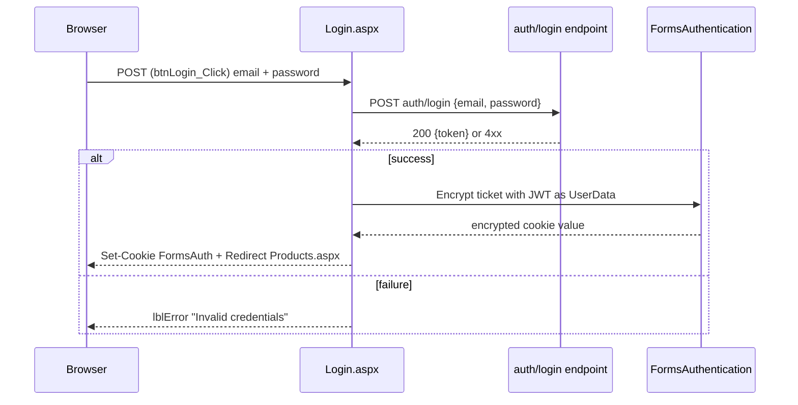
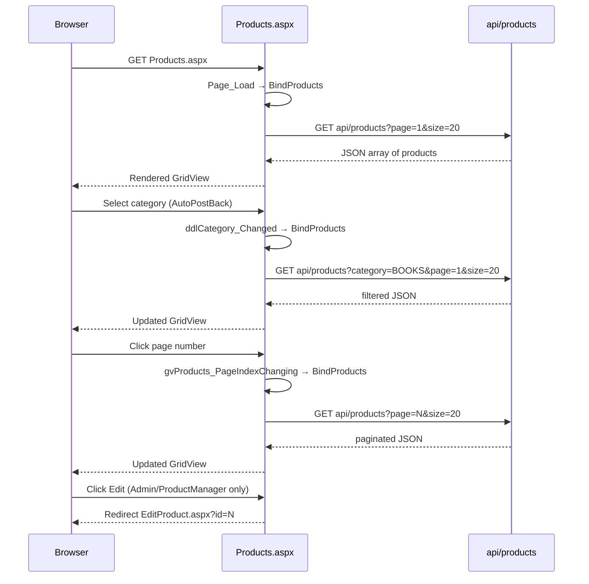

# Legacy Documentation — ContosoStore
**Generated:** 2026-05-02 22:52:49
**Source root:** `sample-legacy-code/`
**Inventory source:** `inventory.json`

---

## Table of Contents
1. [System Overview](#1-system-overview)
2. [Module Map](#2-module-map)
3. [API Surface](#3-api-surface)
4. [Data Model](#4-data-model)
5. [UI Flows](#5-ui-flows)
6. [Business Rules](#6-business-rules)
7. [Integrations](#7-integrations)
8. [Known Smells / Risks](#8-known-smells--risks)
9. [Open Questions for Reviewer](#9-open-questions-for-reviewer)

---

## 1. System Overview

ContosoStore is a two-tier e-commerce application built across two distinct technology stacks that have never been fully unified. The backend is an **ASP.NET Core 6 Web API** (`ContosoStore.Api`) exposing product and order management over HTTP/JSON, secured with JWT bearer tokens and backed by a **Microsoft SQL Server** database via Entity Framework Core 6. The frontend is a **ASP.NET WebForms application** (`ContosoStore.Web`) targeting .NET Framework 4.8; it calls the API from server-side code-behind, stores the JWT inside a Forms Authentication cookie, and renders pages using the classic WebForms postback model. There is no dedicated authentication microservice — a hypothetical `auth/login` endpoint is called from `Login.aspx.cs` but that endpoint does **not exist** in the codebase as read. No message queues, caches, or external SaaS integrations are present.



---

## 2. Module Map

| Project | Type | Target Framework | Responsibility | Key External Dependencies |
|---|---|---|---|---|
| `ContosoStore.Api` | ASP.NET Core Web API | net6.0 | Product CRUD, Order placement and status management, JWT-secured REST API | EF Core + SQL Server, JwtBearer, AutoMapper |
| `ContosoStore.Web` | ASP.NET WebForms | net48 | Server-rendered UI, user login, product browsing, order history | System.Web, Newtonsoft.Json, FormsAuthentication |

### File Tree Summary

```
ContosoStore.sln
├── ContosoStore.Api/
│   ├── Program.cs                        ← DI wiring, JWT config, Swagger
│   ├── appsettings.json                  ← Connection string + JWT key (plaintext!)
│   ├── Controllers/
│   │   ├── ProductsController.cs
│   │   └── OrdersController.cs
│   ├── Services/
│   │   ├── ProductService.cs
│   │   └── OrderService.cs
│   ├── Models/
│   │   ├── Product.cs
│   │   └── Order.cs                      ← also defines OrderItem + OrderStatus enum
│   └── Data/
│       └── StoreDbContext.cs
└── ContosoStore.Web/
    ├── Web.config                         ← ApiBaseUrl, Forms auth settings
    ├── Site.Master                        ← Shared nav layout
    ├── Login.aspx / Login.aspx.cs
    └── Products.aspx / Products.aspx.cs
```

---

## 3. API Surface

All endpoints are served from `ContosoStore.Api`. Base URL is configured in `Web.config` as `https://localhost:5001/api` for the WebForms frontend.

### 3.1 Products — `api/products`

| Method | Path | Auth Required | Roles | Request Body | Response | Notes |
|---|---|---|---|---|---|---|
| GET | `api/products` | No | — | — | `200 IEnumerable<Product>` | Query params: `category`, `page` (default 1), `size` (default 20) |
| GET | `api/products/{id}` | No | — | — | `200 Product` / `404` | Only returns active products (`IsActive=true`) |
| POST | `api/products` | Yes | Admin, ProductManager | `Product` JSON | `201 Created + Product` | Sets `CreatedAt` server-side |
| PUT | `api/products/{id}` | Yes | Admin, ProductManager | `Product` JSON | `200 Product` / `404` | Partial field update; sets `UpdatedAt` server-side |
| DELETE | `api/products/{id}` | Yes | Admin | — | `204 NoContent` / `404` | **Soft delete** — sets `IsActive = false`, does not remove row |

> Source: `ContosoStore.Api/Controllers/ProductsController.cs`, `ContosoStore.Api/Services/ProductService.cs`

### 3.2 Orders — `api/orders`

All order endpoints require an authenticated JWT (`[Authorize]` at controller level).

| Method | Path | Auth Required | Roles | Request Body | Response | Notes |
|---|---|---|---|---|---|---|
| GET | `api/orders/{id}` | Yes | Any authenticated | — | `200 Order` / `404` | Eager-loads `Items` collection |
| GET | `api/orders/customer/{email}` | Yes | Any authenticated | — | `200 IEnumerable<Order>` | No ownership check — any authenticated user can query any email |
| POST | `api/orders` | Yes | Any authenticated | `PlaceOrderRequest` | `201 Created + Order` / `400 {error}` | Decrements stock; throws on insufficient stock or missing product |
| PATCH | `api/orders/{id}/status` | Yes | Admin, Fulfilment | `OrderStatus` (enum int) | `200 Order` / `404` | Bare enum value in body — fragile contract |

> Source: `ContosoStore.Api/Controllers/OrdersController.cs`, `ContosoStore.Api/Services/OrderService.cs`

### 3.3 Auth Endpoint (Referenced but Missing)

`Login.aspx.cs` calls `POST auth/login` with `{ email, password }` and expects `{ token }` in the JSON response body. **This endpoint does not exist in `ContosoStore.Api`** — it is not implemented in any controller in the codebase as inventoried. The application cannot authenticate in its current state without an external or undocumented service providing this endpoint.

> Source: `ContosoStore.Web/Login.aspx.cs` line 13–17

---

## 4. Data Model

### 4.1 Entity Relationship Diagram



### 4.2 Notes on the Data Model

- **Database provider:** Microsoft SQL Server. EF Core migrations are **not present** in the codebase — schema is presumably created via `EnsureCreated` or manual scripts (not observed).
- **Precision:** `Price`, `TotalAmount`, and `UnitPrice` are mapped with `HasPrecision(10, 2)` via `OnModelCreating` (`StoreDbContext.cs`).
- **Soft delete:** `Product.IsActive` is the only deletion mechanism. `DELETE api/products/{id}` flips this flag; there is no hard-delete path.
- **Order status** is stored as an integer enum (`Pending=0, Paid=1, Shipped=2, Delivered=3, Cancelled=4`) — no validation guards against invalid transitions (e.g. `Cancelled → Shipped`).
- **No `PlacedAt` population** is observed in `OrderService.PlaceAsync` — the default `DateTime.UtcNow` property initialiser on the `Order` class handles it, but this is implicit.
- **`UnitPrice` snapshot:** `OrderItem.UnitPrice` is correctly captured at the time of order placement from `product.Price`, preventing price-drift issues. ✔

---

## 5. UI Flows

### 5.1 Login Flow



> Source: `ContosoStore.Web/Login.aspx.cs`

### 5.2 Product Browse Flow



> Source: `ContosoStore.Web/Products.aspx.cs`, `ContosoStore.Web/Products.aspx`

### 5.3 Site Navigation (Master Page)

The `Site.Master` wraps all pages with a top navigation bar containing links to:
- **Home** (`Default.aspx`) — page not present in inventory
- **Products** (`Products.aspx`)
- **My Orders** (`Orders.aspx`) — page not present in inventory
- **Login/Logout status** via `<asp:LoginStatus>`

> Source: `ContosoStore.Web/Site.Master`

---

## 6. Business Rules

The following rules are extracted directly from service and controller code. File and approximate line numbers are cited.

### Products
- **BR-P1 — Active-only reads:** `ListAsync` and `GetAsync` filter `WHERE IsActive = true`. Soft-deleted products are invisible to API consumers. (`ProductService.cs` lines 21, 28)
- **BR-P2 — Pagination defaults:** Product list defaults to page 1, page size 20 when not specified. (`ProductsController.cs` line 11)
- **BR-P3 — Category filter:** Optional `category` query param performs an exact-match filter on `Product.Category`. No partial/wildcard search. (`ProductService.cs` line 23)
- **BR-P4 — Ordered by newest:** Product list is ordered `DESC` by `CreatedAt`. (`ProductService.cs` line 24)
- **BR-P5 — Soft delete only:** Deletion sets `IsActive = false` and stamps `UpdatedAt`; no row is ever removed. (`ProductService.cs` lines 38–42)
- **BR-P6 — Server-side timestamps:** `CreatedAt` is set by `CreateAsync`; `UpdatedAt` is set by `UpdateAsync` and `DeleteAsync`. Client-supplied timestamp values are ignored on write paths. (`ProductService.cs` lines 31, 46, 56)
- **BR-P7 — Name required, max 120 chars; Description max 2000 chars; Price range 0–999999.99.** (`Product.cs` validation attributes)

### Orders
- **BR-O1 — Stock check before placement:** `PlaceAsync` throws `InvalidOperationException` if `product.StockQuantity < qty`. (`OrderService.cs` line 37)
- **BR-O2 — Product existence check:** `PlaceAsync` throws `InvalidOperationException` if a `ProductId` does not exist in the database. (`OrderService.cs` line 35)
- **BR-O3 — Atomic stock decrement:** Stock is decremented in the same `SaveChangesAsync` call that creates the order, providing atomicity within a single DbContext transaction. (`OrderService.cs` lines 38–46)
- **BR-O4 — Unit price snapshot:** `OrderItem.UnitPrice` is populated from the product's current price at order time, not at query time. (`OrderService.cs` line 41)
- **BR-O5 — Total amount computed server-side:** `TotalAmount = SUM(UnitPrice * Quantity)` accumulated in `PlaceAsync`; client cannot supply a total. (`OrderService.cs` lines 42–43)
- **BR-O6 — No status transition guards:** `UpdateStatusAsync` accepts any `OrderStatus` value regardless of current status (e.g. a `Delivered` order can be set to `Pending`). (`OrderService.cs` lines 50–55)
- **BR-O7 — No order ownership enforcement:** `GET api/orders/customer/{email}` returns all orders for any email to any authenticated user — there is no check that the caller's identity matches the queried email. (`OrdersController.cs` line 24)
- **BR-O8 — Default status is Pending:** New orders are always created with `OrderStatus.Pending`. (`OrderService.cs` line 28)

### Auth / Access Control
- **BR-A1 — Product write requires Admin or ProductManager role.**
- **BR-A2 — Product delete requires Admin role only.**
- **BR-A3 — All order endpoints require authentication (any role).**
- **BR-A4 — Order status update requires Admin or Fulfilment role.**
- **BR-A5 — WebForms denies all anonymous users** via `<deny users="?" />` in `Web.config` — the entire Web application requires login.
- **BR-A6 — Edit button in Products grid is conditionally rendered** for `Admin` or `ProductManager` roles only (`IsAdmin()` helper). (`Products.aspx.cs` lines 36–37; `Products.aspx` template field)

---

## 7. Integrations

| Integration | Type | Direction | Protocol | Notes |
|---|---|---|---|---|
| Microsoft SQL Server | Database | Outbound from API | EF Core / TDS | Single `StoreDbContext`; connection string in `appsettings.json` (plaintext, localhost) |
| `auth/login` endpoint | REST API | Outbound from WebForms | HTTP/JSON | Called by `Login.aspx.cs`; **not implemented in the codebase** — likely an undocumented or planned service |
| Browser ↔ WebForms | HTTP | Inbound | HTTP/S postback | Classic WebForms postback; no client-side JavaScript framework |
| WebForms ↔ API | REST | Server-to-server | HTTP/JSON + JWT Bearer | API base URL hardcoded to `https://localhost:5001/api` in `Web.config`; not environment-parameterised |

**No message queues, caches (Redis/Memcached), email services, payment gateways, CDNs, or scheduled jobs** were identified in the codebase.

---

## 8. Known Smells / Risks

The items below are pre-conversion concerns that must be addressed during modernization. Severity is rated **High / Medium / Low**.

### Security

| # | Severity | Description | Location |
|---|---|---|---|
| S1 | **High** | JWT signing key stored as plaintext string in `appsettings.json` (`"REPLACE_ME_WITH_A_LONG_SECRET_KEY_AT_LEAST_32_BYTES"`). This file is likely committed to source control. | `appsettings.json` line 4 |
| S2 | **High** | SQL Server connection string uses `Integrated Security=true` / `Trusted_Connection=True` pointing to `localhost` — hardcoded for developer workstations; unsuitable for any deployed environment. | `appsettings.json` line 3, `Web.config` line 8 |
| S3 | **High** | JWT is stored inside the `FormsAuthenticationTicket.UserData` field and transmitted via a cookie. If the Forms Auth machine key is weak or default, the token can be extracted. | `Login.aspx.cs` lines 14–18 |
| S4 | **High** | `GET api/orders/customer/{email}` has no ownership enforcement — any authenticated user can enumerate orders for any customer email address (IDOR vulnerability). | `OrdersController.cs` line 24 |
| S5 | **Medium** | `auth/login` endpoint is missing from the API — there is no token issuance implementation, meaning the system either relies on an undocumented service or is incomplete. | `Login.aspx.cs` line 13 |
| S6 | **Medium** | No HTTPS enforcement in `Program.cs` (no `UseHttpsRedirection` or HSTS middleware). | `Program.cs` |

### Architecture & Design

| # | Severity | Description | Location |
|---|---|---|---|
| A1 | **High** | Mixed technology stacks: .NET 6 API + .NET Framework 4.8 WebForms in the same solution. The WebForms app cannot run on modern .NET runtimes, blocking containerisation. | `ContosoStore.Web/ContosoStore.Web.csproj` |
| A2 | **High** | WebForms calls the API using `.Result` (blocking async over sync) creating thread-pool deadlock risk under load. | `Login.aspx.cs` line 14; `Products.aspx.cs` line 46 |
| A3 | **Medium** | `Products.aspx.cs` uses a `static readonly HttpClient` with a mutable `DefaultRequestHeaders.Authorization` — this is not thread-safe across concurrent requests and will leak tokens between users. | `Products.aspx.cs` lines 14–16, 37–38 |
| A4 | **Medium** | EF Core migrations are absent. Schema management strategy is unknown — risk of schema drift between environments. | No `Migrations/` folder observed |
| A5 | **Medium** | `AutoMapper` is registered in `Program.cs` but no mapping profiles are defined anywhere in the codebase. The API returns raw EF entities directly, exposing internal model details. | `Program.cs` line 18; no `*Profile.cs` files found |
| A6 | **Medium** | No error handling middleware in `Program.cs`. Unhandled exceptions will return raw stack traces (in development) or blank 500 responses. | `Program.cs` |
| A7 | **Low** | `ApiBaseUrl` in `Web.config` is hardcoded to `https://localhost:5001/api` — requires manual change per environment with no environment-variable override path. | `Web.config` line 3 |
| A8 | **Low** | `EditProduct.aspx` is referenced via redirect in `Products.aspx.cs` but does not exist in the codebase. | `Products.aspx.cs` line 33 |
| A9 | **Low** | `Default.aspx` and `Orders.aspx` are linked from `Site.Master` but do not exist in the codebase. | `Site.Master` lines 10–11 |

### Code Quality

| # | Severity | Description | Location |
|---|---|---|---|
| Q1 | **Medium** | No order status transition validation — any status can be applied to any order regardless of current state (e.g. re-opening a delivered order). | `OrderService.cs` lines 50–55 |
| Q2 | **Medium** | `ListForCustomerAsync` uses `.ContinueWith` anti-pattern for type casting instead of `await`; risks running on a thread-pool thread without proper context. | `OrderService.cs` lines 17–21 |
| Q3 | **Medium** | No structured/JSON logging. Default ASP.NET Core console logging only — no correlation IDs, no request tracing, no log aggregation support. | `appsettings.json`, `Program.cs` |
| Q4 | **Low** | `txtSearch` field exists in `Products.aspx` but the search text is never sent to the API in `BindProducts()` — search functionality is non-functional. | `Products.aspx.cs` line 39–43; `Products.aspx` |
| Q5 | **Low** | No input validation on `PlaceOrderRequest.Email` — an empty or malformed email can be persisted as `CustomerEmail`. | `OrdersController.cs`, `OrderService.cs` |
| Q6 | **Low** | `OrderStatus` is sent as a raw integer in the PATCH body — no `[JsonConverter]` or enum-name binding, making the contract fragile and undiscoverable. | `OrdersController.cs` line 37 |

---

## 9. Open Questions for Reviewer

Before modernization proceeds, the following questions must be answered by a human with business and operational knowledge:

1. **Missing `auth/login` endpoint:** Where does token issuance currently live? Is there a separate identity service, a vendor IdP (e.g. Azure AD, Okta), or is this endpoint planned but not yet built? The entire login flow is broken without it.
2. **Missing pages:** `EditProduct.aspx`, `Default.aspx`, and `Orders.aspx` are referenced but absent. Are these lost, never built, or excluded from this repository snapshot? Should they be recreated during modernization?
3. **Database schema:** Are Flyway/EF migrations, or a schema script, available? What is the current production schema version and does it match the entity model?
4. **Order status transitions:** Are there defined valid transitions (e.g. `Pending → Paid → Shipped → Delivered`)? Should `Cancelled` be a terminal state? This needs a state-machine specification before porting.
5. **Order ownership / multi-tenancy:** Should customers be able to see only their own orders? The current IDOR on `GET /customer/{email}` suggests no ownership enforcement was intentional — but this needs confirmation.
6. **Roles / identity store:** Where are user roles (`Admin`, `ProductManager`, `Fulfilment`) stored and managed? There is no user or role management surface in the codebase.
7. **JWT key management:** The JWT key is a placeholder in `appsettings.json`. What is the actual production key, and how is it managed (Key Vault, Secrets Manager, environment variable)?
8. **Product search:** Is the `txtSearch` field on `Products.aspx` intentionally non-functional, or is text-search a required feature that was never implemented? Should it search `Name` and/or `Description`?
9. **Category list:** The category dropdown in `Products.aspx` is hardcoded (`BOOKS`, `ELECTRONICS`, `CLOTHING`). Should categories be data-driven (from a `Categories` table)?
10. **Soft-delete visibility:** Should admins be able to view and restore soft-deleted products? The current API provides no such surface.
11. **Concurrency:** No optimistic concurrency tokens (`RowVersion`/`xmin`) are present on any entity. Is concurrent product editing a real-world concern for this business?
12. **Target deployment environment:** Confirm OpenShift as the sole deployment target (per architecture guide). Are there any on-premises or Windows-only dependencies that would prevent containerisation?

---

*This document was generated by the documenter agent from direct source reading. All claims are grounded in the files listed under each section. No content has been invented.*
