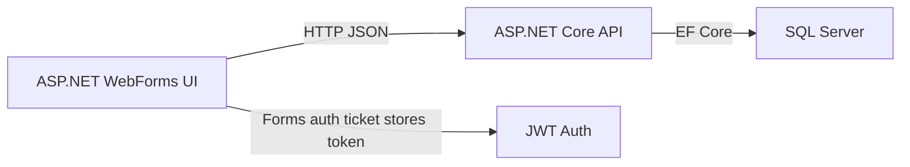
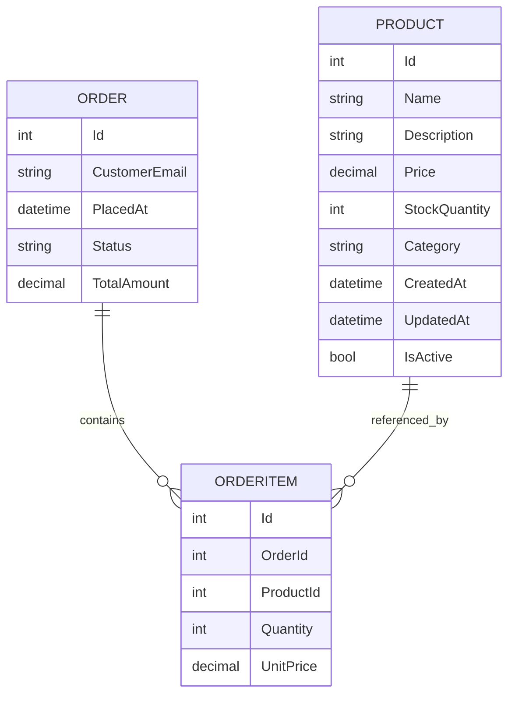
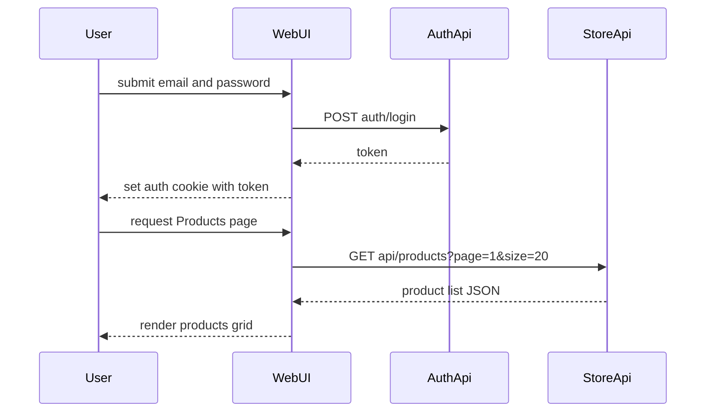

# Legacy Documentation

## System Overview
Contoso Store is a bifurcated legacy system consisting of an ASP.NET WebForms front end (`ContosoStore.Web`) and an ASP.NET Core 6 API backend (`ContosoStore.Api`). The WebForms UI uses Forms Authentication and proxies user actions to the API via JSON HTTP calls. The backend exposes REST endpoints for product management and order processing, and persists data to SQL Server through Entity Framework Core.

## Module Map

Project | Responsibility | External dependencies
--- | --- | ---
`ContosoStore.Web` | UI layer and legacy page navigation. Implements product browsing and login flow that calls backend API endpoints. | `System.Web`, `Newtonsoft.Json`, `FormsAuthentication`, `HttpClient`
`ContosoStore.Api` | REST API for products and orders. Implements business service layer, EF Core persistence, JWT bearer auth, Swagger in development. | `Microsoft.EntityFrameworkCore.SqlServer`, `Microsoft.AspNetCore.Authentication.JwtBearer`, `AutoMapper.Extensions.Microsoft.DependencyInjection`

## API Surface

Method | Path | Auth | Request | Response | Notes
--- | --- | --- | --- | --- | ---
GET | `/api/products` | none | query `category`, `page`, `size` | `IEnumerable<Product>` | returns only `IsActive` products; paging supported via `ProductsController.List` (`ContosoStore.Api/Controllers/ProductsController.cs`)
GET | `/api/products/{id}` | none | path `id` | `Product` or `404` | only active products returned
POST | `/api/products` | `Admin,ProductManager` | `Product` body | `201 Created` with `Product` | creates product and sets `CreatedAt` UTC
PUT | `/api/products/{id}` | `Admin,ProductManager` | `Product` body | `200 OK` or `404` | updates product fields and `UpdatedAt` UTC
DELETE | `/api/products/{id}` | `Admin` | path `id` | `204 NoContent` or `404` | soft deletes by setting `IsActive=false`
GET | `/api/orders/{id}` | authenticated | path `id` | `Order` or `404` | order retrieval includes items
GET | `/api/orders/customer/{email}` | authenticated | path `email` | `IEnumerable<Order>` | returns orders for customer email sorted desc
POST | `/api/orders` | authenticated | `PlaceOrderRequest` | `201 Created` with `Order` or `400` | validates product existence and stock, decrements stock
PATCH | `/api/orders/{id}/status` | `Admin,Fulfilment` | `OrderStatus` body | `200 OK` or `404` | updates order status

Note: the legacy WebForms login page calls `auth/login` but no auth controller is present in this repository (`ContosoStore.Web/Login.aspx.cs`).

## Data Model

## UI Flows

The main observable flows in the legacy UI are:
- Login via `Login.aspx`: user submits email/password → `auth/login` API call → JWT token stored in Forms Authentication ticket user data → redirect to `Products.aspx`.
- Products browsing via `Products.aspx`: category filter and search triggers postback → UI calls backend `GET api/products` with page and category → binds JSON result to `GridView`.

## Business Rules

- Product visibility is restricted to active products only (`ProductService.ListAsync`, `GetAsync` in `ContosoStore.Api/Services/ProductService.cs`).
- Product creation records UTC creation time and persists new product state.
- Product updates preserve identity and set `UpdatedAt = DateTime.UtcNow` (`ProductService.UpdateAsync`).
- Product deletion is a soft delete: `IsActive = false` and `UpdatedAt` updated (`ProductService.DeleteAsync`).
- Order placement requires existing products and sufficient stock; the service decrements stock quantities and computes `TotalAmount` (`OrderService.PlaceAsync` in `ContosoStore.Api/Services/OrderService.cs`).
- Orders are returned for a given customer email sorted by placement date descending (`OrderService.ListForCustomerAsync`).
- Order status changes are restricted to roles `Admin` and `Fulfilment` and persist new status (`OrdersController.UpdateStatus`, `OrderService.UpdateStatusAsync`).
- API authentication is JWT bearer token based for order endpoints; product management endpoints enforce role-based authorization.
- Legacy UI login stores the bearer token inside a Forms Authentication ticket user data field (`ContosoStore.Web/Login.aspx.cs`).

## Integrations

- SQL Server via EF Core `StoreDbContext` with `Microsoft.EntityFrameworkCore.SqlServer` (`ContosoStore.Api/Data/StoreDbContext.cs`).
- JWT bearer authentication configured in `ContosoStore.Api/Program.cs` with issuer, audience, and symmetric key from configuration.
- Legacy WebForms UI consumes API endpoints through `HttpClient` using `ApiBaseUrl` from `ContosoStore.Web/Web.config`.
- `auth/login` authentication endpoint is an external dependency for the legacy login flow (`ContosoStore.Web/Login.aspx.cs`).
- Swagger/OpenAPI is enabled in development only via `Program.cs`.

## Known Smells / Risks

- Mixed legacy architecture: ASP.NET WebForms UI coupled to a newer ASP.NET Core backend.
- Incomplete auth surface: login flow relies on `auth/login`, but there is no auth controller in the repository.
- Synchronous blocking calls in UI code: `GetStringAsync(...).GetAwaiter().GetResult()` in `ContosoStore.Web/Products.aspx.cs`.
- Token handling is brittle: JWT is stored in Forms Authentication ticket user data rather than a dedicated SPA-friendly auth flow.
- Hardcoded local API base URL in `Web.config` (`https://localhost:5001/api`).
- Potential secret exposure: JWT key loaded directly from config in `ContosoStore.Api/Program.cs`.
- UX and security risk: no validation on `PlaceOrderRequest` model in `OrdersController.cs`.
- Odd async pattern in `OrderService.ListForCustomerAsync` using `ContinueWith` instead of `await`.
- No authorization checks on order ownership in `/api/orders/{id}`; any authenticated user may retrieve any order if they know the id.
- Soft delete on products may leave inactive products in database and does not cascade to any historical order logic.

